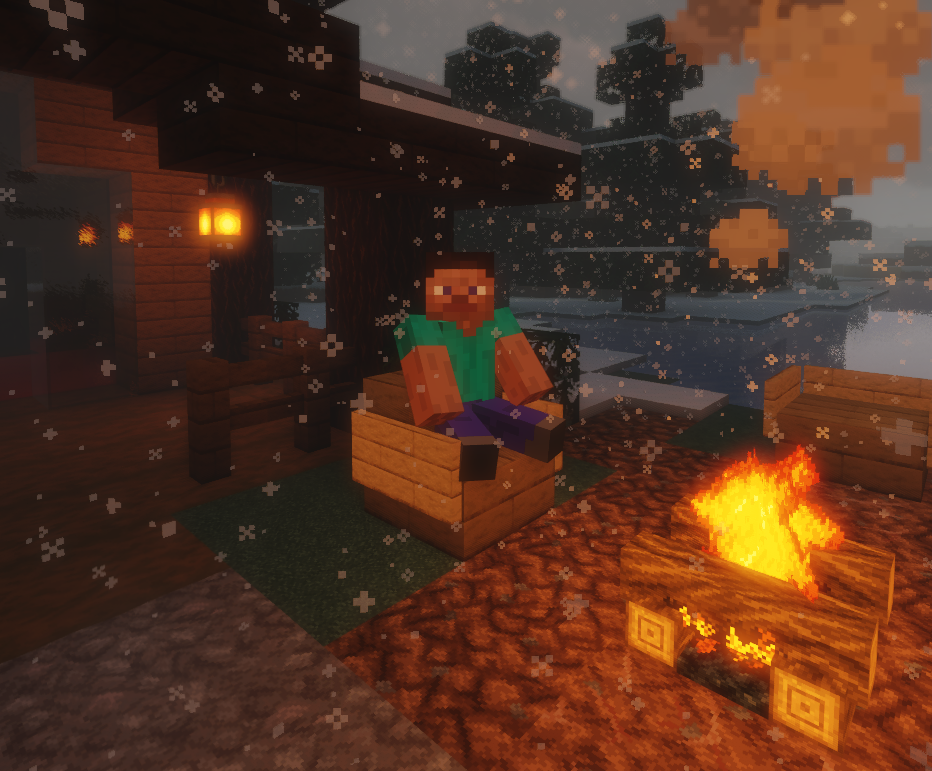

# Sit Plugin v1.0
A simple plugin to allow your players to sit down on stairs.

[](https://opensource.org/licenses/MIT)

---

# Introduction
This plugin allows your players to sit on stairs by right clicking on it. You can toggle the ability to sit by running ``/sittoggle``.




## Commands
| Command        | Description                | Aliases                                      | Permissions |
|----------------|----------------------------|----------------------------------------------|-------------|
| ``/sittoggle`` | Toggles the ability to sit | ``/stoggle``, ``/chairtoggle``, ``/ctoggle`` | _none_      |

## Installing

Simply copy the JAR file into your server plugins folder and restart.

## Building

#### Requirements
* JDK 8 or newer
* Git

#### Compiling
```shell
git clone https://github.com/TRYTIG/SitPlugin
cd SitPlugin
./gradlew build
```
Compiled JAR files will be in the `build/libs` directory

## License

Sit Plugin is licensed under the permissive MIT license. See [`LICENSE.txt`](LICENSE.txt) for more information.